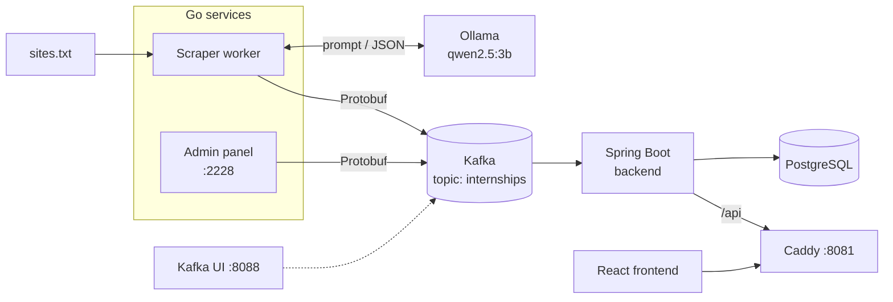

# AI Internship Aggregator

Aggregates internship postings from tech-company career pages into a single dashboard.
Instead of writing a brittle CSS-selector parser per site, a local LLM (Ollama) extracts
structured data from arbitrary HTML. Services communicate through Kafka using a shared
Protobuf contract.

## Architecture



**Pipeline** (repeats every `SCRAPE_INTERVAL`, default 6h):

1. The Go scraper reads URLs from `scrapper/config/sites.txt` and downloads each page
   (worker pool, global rate limit, retries with exponential backoff, 10 MiB body cap).
2. HTML is stripped to plain text ([bluemonday](https://github.com/microcosm-cc/bluemonday)).
3. The text goes to a local LLM via Ollama; the model returns a JSON array —
   one object per internship track (backend / frontend / mobile / …).
4. Each track is serialized to Protobuf and published to Kafka, keyed by company.
5. The Java backend consumes the topic, persists to PostgreSQL and serves a REST API.
6. The React frontend talks to the API through Caddy.

The admin panel is a second, independent Kafka producer — it pushes hand-filled
vacancies through the same Protobuf contract.

## Components

| Service          | Tech                        | Port         | Notes                                   |
|------------------|-----------------------------|--------------|-----------------------------------------|
| `parser`         | Go, segmentio/kafka-go      | —            | scraping pipeline, runs on a schedule    |
| `manual-control` | Go, Gin, IBM/sarama         | `:2228`      | admin panel for manual vacancy input     |
| `backend`        | Java 21, Spring Boot        | via Caddy    | Kafka consumer + REST API                |
| `frontend`       | React, Vite                 | via Caddy    | dashboard UI                             |
| `caddy`          | Caddy 2.9                   | `:8081`      | reverse proxy: `/api` → backend, rest → frontend |
| `kafka`          | Apache Kafka 4.2 (KRaft)    | `:9094` ext  | single broker, dev setup                 |
| `kafka-ui`       | provectuslabs/kafka-ui      | `:8088`      | localhost only, not proxied              |
| `postgres`       | PostgreSQL 18               | —            | internal only                            |
| `ollama`         | Ollama + qwen2.5:3b         | —            | internal only                            |

## Quick start

Prerequisites: [Docker](https://docs.docker.com/get-docker/) and [Task](https://taskfile.dev/installation).

```bash
git clone https://github.com/BleSSSeDDD/ai-internship-aggregator.git
cd ai-internship-aggregator
cp .env.example .env     # optional — every variable has a sane default
task up-with-model       # builds images, starts the stack, pulls the LLM (~2 GB on first run)
```

After startup:

- Frontend — http://localhost:8081
- Admin panel — http://localhost:2228
- Kafka UI — http://localhost:8088

## Configuration

The scraper is configured entirely through environment variables (see `docker-compose.yml`):

| Variable             | Default                  | Meaning                                |
|----------------------|--------------------------|----------------------------------------|
| `OLLAMA_URL`         | `http://ollama:11434`    | Ollama endpoint                        |
| `OLLAMA_MODEL`       | `qwen2.5:3b`             | model used for extraction              |
| `AI_TIMEOUT`         | `10m`                    | per-page LLM request timeout           |
| `KAFKA_BROKERS`      | `kafka:9092`             | comma-separated broker list            |
| `KAFKA_TOPIC`        | `internships`            | output topic                           |
| `SITES_FILE`         | `/config/sites.txt`      | list of URLs to scrape                 |
| `SCRAPE_CONCURRENCY` | `3`                      | parallel page workers                  |
| `SCRAPE_INTERVAL`    | `6h`                     | pause between scrape cycles            |

## Development

```bash
task test    # go test for both Go services
task vet     # go vet for both Go services
task logs    # tail all containers
task status  # containers + kafka topics + ollama models
```

The Go services follow a hexagonal-ish layout — business logic depends only on
interfaces, infrastructure is swappable adapters:

```
scrapper/
├── cmd/worker/            # entrypoint: config, worker pool, scheduling
├── internal/domain/       # interfaces: Parser, AIProcessor, Publisher
├── internal/usecase/      # pipeline: fetch → extract → publish
├── internal/infrastructure/
│   ├── httpclient/        # page fetching: retries, backoff, rate limit
│   ├── aiprocessor/       # Ollama client, prompt, response parsing
│   └── kafka/             # protobuf → Kafka producer
└── gen/go/vacancy/        # generated from proto/vacancy.proto
```

`proto/vacancy.proto` is the single source of truth for the message schema,
shared by the Go producers and the Java consumer.

## Design decisions & trade-offs

- **LLM instead of per-site parsers.** Career pages have wildly different markup and
  change often; one prompt replaces N brittle selector parsers. The cost: extraction is
  slow (local CPU inference) and the output needs defensive parsing — the model
  occasionally returns a single object or wraps JSON in markdown fences, both handled.
- **Kafka + Protobuf between services.** Producers (scraper, admin panel) and the
  consumer (backend) are fully decoupled: they share only the `.proto` contract and can
  be developed, deployed and restarted independently.
- **Interfaces at the domain boundary.** The pipeline is tested with fakes; the HTTP
  and Ollama adapters are tested against `httptest` servers — no Docker needed to run
  the unit tests.

Known limitations (honest list): no deduplication between scrape cycles,
JS-rendered pages are not supported (no headless browser), LLM output is validated
only as JSON (no schema/enum validation), single-broker Kafka is a dev-only setup.
